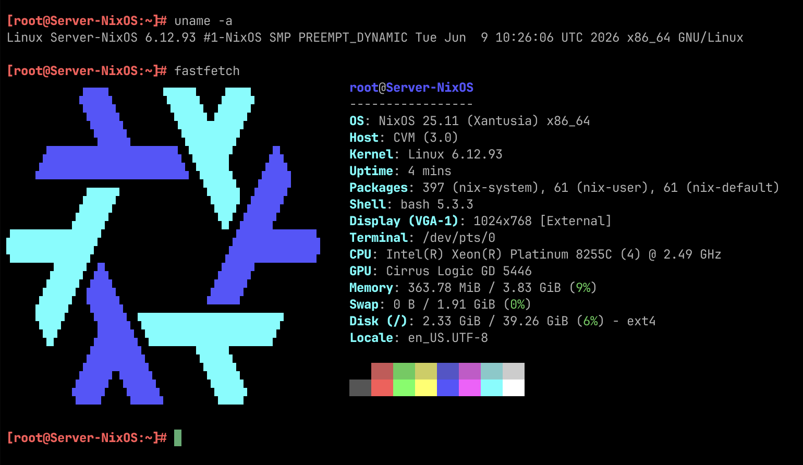
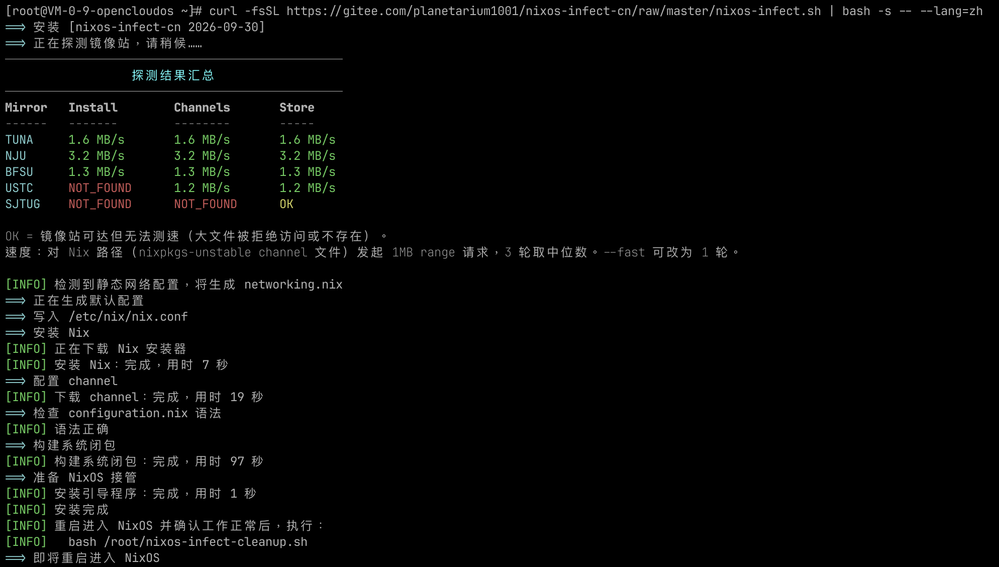
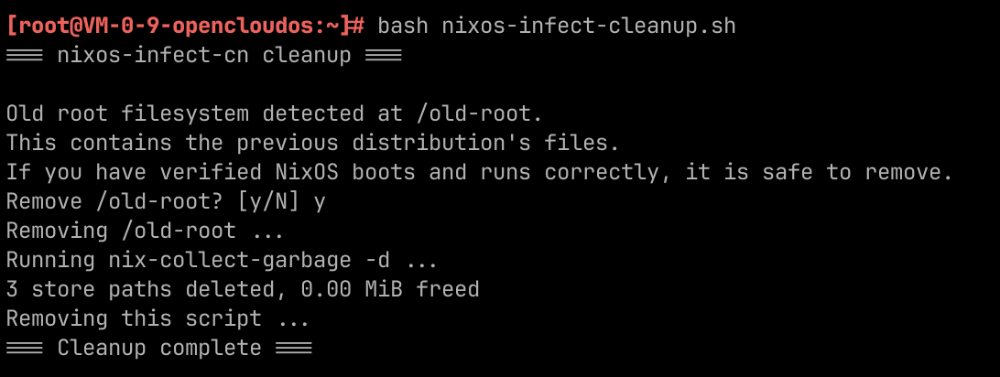
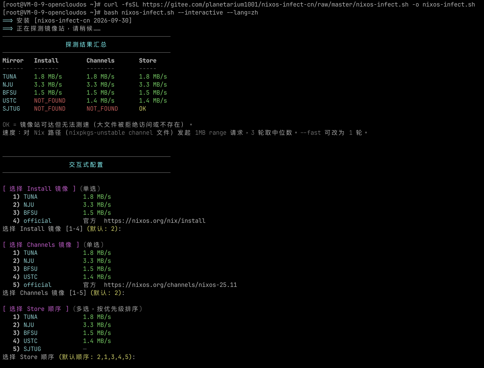
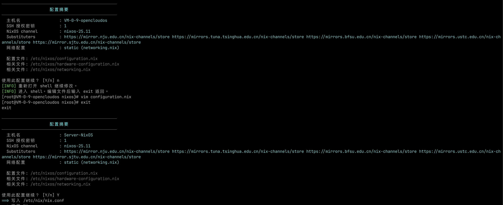
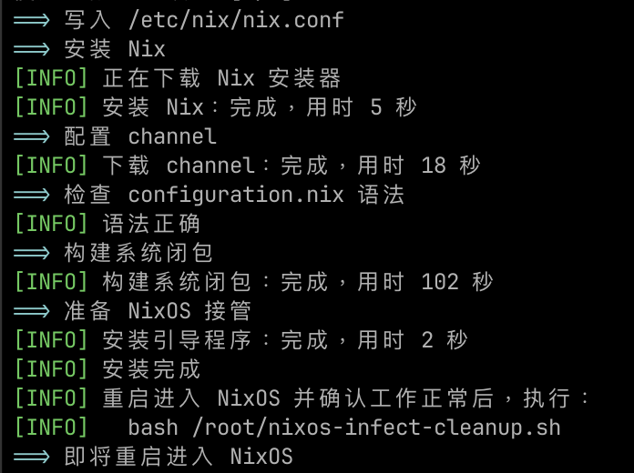

# nixos-infect-cn

使用国内镜像源，将云服务器系统转换为 NixOS。



| 项目 | 内容 |
| --- | --- |
| 版本 | `2026-10-01` |
| 上游 | [elitak/nixos-infect](https://github.com/elitak/nixos-infect) |
| 参考 | [lzc256/nixos-infect-cn](https://github.com/lzc256/nixos-infect-cn)、[kidonng/nixos-infect-tuna](https://gist.github.com/kidonng/852ea559816420acaf33017c6e7ccf8b) |

单文件、免构建。安装器、channel、二进制缓存均使用国内镜像，无需额外网络配置，自动探测最新稳定版。

## 警告

- **会清空服务器磁盘**。请只在新机器上运行，并确认没有需要保留的数据。
- **必须先配置 SSH 公钥登录**。转换后 root 账户没有密码，公钥是唯一的登录方式。
- 不支持 OpenVZ / LXC 等共享内核虚拟化。

## 已验证平台

| 平台 | 原始系统 | 引导 | 结果 |
| --- | --- | --- | --- |
| 腾讯云 Lighthouse | OpenCloudOS 8 | BIOS | 通过 |
| 腾讯云 Lighthouse | OpenCloudOS 9 | BIOS | 通过 |
| 腾讯云 Lighthouse | Ubuntu 20.04 LTS | BIOS | 通过 |
| 腾讯云 Lighthouse | Ubuntu 22.04 LTS | BIOS | 通过 | 
| 腾讯云 Lighthouse | Ubuntu 24.04 LTS | BIOS | 通过 |
| 腾讯云 Lighthouse | Ubuntu 26.04 LTS | BIOS | 通过 | 
| 腾讯云 Lighthouse | Debian 10.2 | BIOS | 通过 |
| 腾讯云 Lighthouse | Debian 11.1 | BIOS | 通过 |
| 腾讯云 Lighthouse | Debian 12.0 | BIOS | 通过 |
| 腾讯云 Lighthouse | Debian 13.2 | BIOS | 通过 |

> 测试说明
> - 覆盖腾讯云 Lighthouse 当前可选的 Debian 与 Ubuntu 镜像，均为 KVM + BIOS 实例。  
> - 转换结果为 NixOS 25.11：DHCP 正常、SSH 可登录、host key 保留，安装后
`nix-channel --update` 与 `nixos-rebuild` 均走国内镜像。

**未列出的系统版本未经验证。** 上游的经验是 LTS 版本稳定，非 LTS（如 Ubuntu 22.10 / 23.10）
失败。EFI 引导尚未实测。

## 快速开始

```bash
# 1. 确认可以用密钥登录（转换后 root 无密码）
ssh-copy-id root@<服务器IP>

# 2. 一键安装（中文输出，全自动）
curl -fsSL https://cdn.jsdelivr.net/gh/planetarium1001/nixos-infect-cn@master/nixos-infect.sh | bash -s -- --lang=zh
```

脚本会自动探测镜像、生成配置、安装 NixOS，完成后自动重启。

重启进入 NixOS 并确认工作正常后，可通过如下命令自动清理安装残留文件以及原系统的备份(old-root)
```bash
bash /root/nixos-infect-cleanup.sh
```




### 下载源

| 源 | 地址 |
| --- | --- |
| jsDelivr（推荐） | `https://cdn.jsdelivr.net/gh/planetarium1001/nixos-infect-cn@master/nixos-infect.sh` |
| Gitee 镜像 | `https://gitee.com/planetarium1001/nixos-infect-cn/raw/master/nixos-infect.sh` |
| GitHub 加速 | `https://gh-proxy.com/https://raw.githubusercontent.com/planetarium1001/nixos-infect-cn/master/nixos-infect.sh` |
| GitHub 原始 | `https://raw.githubusercontent.com/planetarium1001/nixos-infect-cn/master/nixos-infect.sh` |

- jsDelivr 会缓存分支引用，需要马上取到最新版，需把 `@master` 换成具体的 commit id，或用 `https://purge.jsdelivr.net/gh/<user>/<repo>@master/<path>` 主动清缓存。
- Gitee 镜像同步自 GitHub，推送后会有一段时间仍为旧版。
- **GitHub 原始地址在国内不稳定**，时通时断，不建议直接使用。
- Gitee 对内容较多的文件有内容审核，`raw` 访问可能返回 `451`。
- 管道执行时没有终端，**无法交互**，所有提问自动取默认值。

## 修改配置

生成的配置**默认继承原系统**的主机名、域名等信息。  
如需调整，有以下三种方式。
如果你想配置用户、flake等，也可以通过如下方式自己编写修改配置文件。

### 方式一：交互模式（推荐）

**修改 `configuration.nix` 等 Nix 文件必须使用交互模式。**  
管道执行时没有终端，无法进入编辑流程，因此需先下载脚本：

```bash
curl -fsSL https://cdn.jsdelivr.net/gh/planetarium1001/nixos-infect-cn@master/nixos-infect.sh -o nixos-infect.sh
bash nixos-infect.sh --interactive --lang=zh
```

流程如下：

1. 探测镜像并显示汇总表
2. 三次选择：安装器镜像、channel 镜像、二进制缓存优先级
3. 显示配置摘要
4. 回答 `n` 进入 `/etc/nixos` 下的 shell，直接编辑 `configuration.nix`；`exit` 返回
5. 摘要会**重新读取文件内容**，显示的即是最终生效的配置，确认后开始安装





### 方式二：外部模板

```bash
bash nixos-infect.sh --lang=zh \
  --template=configuration:/root/my-configuration.nix \
  --template=networking:/root/my-networking.nix
```

模板中的 `@@NAME@@` 占位符会被替换；去掉占位符写成静态内容同样可行。

### 方式三：直接修改脚本内置模板

脚本 `SECTION 11` 即内置模板，直接编辑即可。

### 可用占位符

`configuration`：`@@HOSTNAME@@` `@@DOMAIN@@` `@@ZRAM@@` `@@NETWORK_IMPORT@@`
`@@SUBSTITUTERS_BLOCK@@` `@@DEFAULT_CHANNEL@@` `@@AUTHORIZED_KEYS@@`

`hardware`：`@@ESP@@` `@@GRUBDEV@@` `@@ROOTFSDEV@@` `@@ROOTFSTYPE@@` `@@SWAPCFG@@`
`@@AVAILABLE_KERNEL_MODULES@@`

`networking`：`@@ETH0_NAME@@` `@@ETH0_IP4S@@` `@@ETH0_IP6S@@` `@@GATEWAY@@` `@@GATEWAY6@@`
`@@ETHER0@@` `@@NAMESERVERS@@` `@@PREDICTABLE_INAMES@@`

## 常用参数

| 参数 | 说明 |
| --- | --- |
| `--lang=zh` | 中文输出（默认 `en`） |
| `--interactive` | 交互模式：选择镜像、编辑配置。需要终端 |
| `--dry-run` | 只探测并生成配置，不安装。输出到 `/tmp/nixos-infect-dryrun` |
| `--no-reboot` | 安装后不重启，便于先检查产物 |
| `--no-probe` | 跳过探测，直接使用保底镜像顺序 |

## 完整参数

| 参数 | 说明 |
| --- | --- |
| `--lang=en\|zh` | 输出语言，默认 `en` |
| `--interactive` | 交互模式：选择镜像、编辑配置。需要终端 |
| `--auto` | 全自动，默认 |
| `--yes` | 跳过确认提示（仅交互模式下存在提示） |
| `--verbose` | 打印 debug 日志，并原样输出安装器与 Nix 的完整过程 |
| `--no-color` | 关闭彩色输出 |
| `--skip-probe` | 复用 1 小时内的探测缓存，无缓存时询问是否重新测速 |
| `--no-probe` | 不探测，直接使用保底顺序 |
| `--fast` | 快速探测，每个镜像只测 1 轮（默认 3 轮取中位数） |
| `--prefer=NAME` | 优先镜像：`TUNA` `NJU` `BFSU` `USTC` `SJTUG` |
| `--channel=CHANNEL` | 指定 NixOS channel，默认自动探测最新稳定版 |
| `--template=TYPE:PATH` | 用外部模板覆盖内置模板，可重复。`TYPE` = `configuration` / `hardware` / `networking` |
| `--networking` | 强制生成 `networking.nix`（静态 IP 场景） |
| `--no-networking` | 禁止生成 `networking.nix` |
| `--dry-run` | 只探测并生成配置，不安装 |
| `--no-infect` | 只做准备，不执行安装 |
| `--no-reboot` | 安装后不重启 |
| `--no-swap` | 不创建临时 swap |
| `--help` | 显示帮助与版本号 |

## 环境变量

显式设置的环境变量优先级高于探测结果。

| 变量 | 默认值 | 说明 |
| --- | --- | --- |
| `NIX_INSTALL_URL` | 自动探测 | Nix 安装器地址 |
| `NIX_CHANNEL` | 自动探测 | NixOS channel，如 `nixos-25.11` |
| `NIX_CHANNEL_URL` | 自动探测 | channel tarball 地址 |
| `NIX_SUBSTITUTERS` | 自动探测 | 空格分隔，自动去重并过滤 `cache.nixos.org` |
| `CONFIG_DIR` | `/etc/nixos` | 配置输出目录 |
| `LOG_FILE` | `/var/log/nixos-infect.log` | 日志文件，不可写时自动关闭文件日志 |
| `NO_REBOOT` / `NO_SWAP` / `NO_INFECT` | 空 | 非空则生效，含义与同名参数一致 |

## 镜像与探测

保底顺序：**TUNA → NJU → BFSU → USTC → SJTUG**。

| 镜像 | 安装器 | channel | 二进制缓存 |
| --- | --- | --- | --- |
| TUNA（清华） | &#10004 | &#10004 | &#10004 |
| NJU（南大） | &#10004 | &#10004 | &#10004 |
| BFSU（北外） | &#10004 | &#10004 | &#10004 |
| USTC（中科大） | &cross | &#10004 | &#10004 |
| SJTUG（上交） | &cross | &#10004 | &#10004 |

安装器、channel、二进制缓存三个维度独立探测，按实测速度排序。  
探测结果缓存在`/tmp/nixos-infect-cn.probe`，有效期 1 小时。  
生成的配置中**不会写入 `cache.nixos.org`**（由 Nix 自行追加在末尾作为兜底）。

## 重启之后

```bash
ssh root@<服务器IP>          # 沿用原有密钥，host key 保持不变
nixos-version                # 预期 25.11 (Xantusia)
nix-channel --list           # 应指向国内镜像，而非 channels.nixos.org
nix config show | grep substituters
```

确认系统运行正常后，清理旧系统残留（会交互确认删除 `/old-root`，通常可释放数 GB）：

```bash
bash /root/nixos-infect-cleanup.sh
```

## 注意事项

### GRUB 菜单等待时间

生成的配置未显式设置 `boot.loader.timeout`，使用 NixOS 默认值 **5 秒**。  
确认系统能正常启动之后，可编辑 `/etc/nixos/configuration.nix` 缩短等待：

```nix
boot.loader.timeout = 1;
```

保存后执行 `nixos-rebuild switch` 生效。

### 重启后长时间无法 SSH

若重启后较长时间仍无法登录，**请优先通过云厂商控制台的 VNC 连接查看**。常见原因是卡在
关机阶段 —— 脚本已发出重启指令，但系统未真正完成重启。在 VNC 中手动重启一次即可正常
进入 NixOS。

### 云厂商监控程序

部分云厂商在镜像内预装了资源监控程序（如腾讯云的监控组件）。转换为 NixOS 后这些程序不再
运行，控制台的 CPU、内存等监控指标会缺失。如需保留，请参照云厂商官方文档在 NixOS 上重新
安装对应组件。

### 宿主机自行引导的平台

少数镜像（实测腾讯云 Debian 11 / 12）的**宿主机自己解析 `/boot/grub/grub.cfg` 并直接引导
内核**，不经过磁盘 GRUB。两个表现：

- VNC / 串口里**看不到 GRUB 菜单**，开机直接进系统
- 宿主机**缓存**这份解析结果，只有 `/boot` 下的内核文件变化时才重新读取

第二条会直接破坏接管：脚本改写了 `grub.cfg`，但宿主机缓存未失效，重启后仍按**原系统的
引导项**启动。现象是「安装成功、重启、仍是原系统」，而磁盘上的 GRUB、`grub.cfg`、MBR
看起来全都正确 —— 因为宿主机并未读取它们。

脚本已自动处理：`finalize_nixos` 在装完引导程序后会 `touch` 一遍 `/boot/vmlinuz-*` 与
`/boot/initrd.img-*` 使缓存失效。**文件内容无关紧要**，只需要「已变化」这一信号 —— 实测
即使 `/boot` 下仍是原发行版的内核，重启后也会按新的 `grub.cfg` 启动 NixOS。在靠磁盘 GRUB
引导的平台上，这一步是无害的空操作。

## 排障

安装前脚本会做一次自检，打印引导模式、根设备、`NIXOS_LUSTRATE` 内容等。若
`NIXOS_LUSTRATE` 为空或缺失，脚本会**直接中止、不重启**，避免重启后系统处于不可用状态。

首次在新机器上建议分两步执行：

```bash
# 第一步：只安装、不重启，检查产物
bash nixos-infect.sh --no-reboot --lang=zh
cat /etc/NIXOS_LUSTRATE
cat /etc/nixos/configuration.nix
ls -l /nix/var/nix/profiles/system

# 第二步：确认无误后重启
reboot
```

遇到「重启后仍是原系统」时，可这样确认：

```bash
cat /etc/NIXOS_LUSTRATE                         # 仍存在 = NixOS 从未启动过
tr ' ' '\n' < /proc/cmdline | grep BOOT_IMAGE   # 查看实际引导的内核
touch /boot/vmlinuz-* /boot/initrd.img-* && reboot   # 手动使宿主机缓存失效后重试
```

日志位于 `/var/log/nixos-infect.log`，加 `--verbose` 可同时打印到屏幕。若重启后无法 SSH，
请提供 VNC / 串口引导日志。

## 致谢

- [elitak/nixos-infect](https://github.com/elitak/nixos-infect) —— 上游项目
- [lzc256/nixos-infect-cn](https://github.com/lzc256/nixos-infect-cn) —— 参考实现
- [kidonng/nixos-infect-tuna](https://gist.github.com/kidonng/852ea559816420acaf33017c6e7ccf8b) —— TUNA 补丁思路
- TUNA、NJU、BFSU、USTC、SJTUG 镜像站

上游原始 README 见 [README.upstream.md](./README.upstream.md)。

## License

[GNU General Public License v3.0](./LICENSE)，与上游保持一致。
